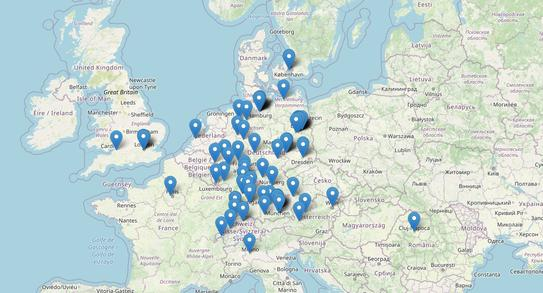

# Awesome Sustainability Jobs

A curated list of awesome dev jobs in the sustainability sector.\
[Contributions](https://github.com/pogopaule/awesome-sustainability-jobs/blob/main/CONTRIBUTING.md) are highly appreciated. Especially for jobs outside of Germany.

Looking for open source projects instead? [Go here](https://github.com/protontypes/open-sustainable-technology)

---

## Map

[Show companies on a map](https://awesome-sustainability-jobs.netlify.app/) 🗺️

## List

- [Australia](#australia)
- [Austria](#austria)
- [Denmark](#denmark)
- [Finland](#finland)
- [France](#france)
- [Germany](#germany)
- [India](#india)
- [Italy](#italy)
- [Luxembourg](#luxembourg)
- [Netherlands](#netherlands)
- [Philippines](#philippines)
- [Romania](#romania)
- [Spain](#spain)
- [Sweden](#sweden)
- [Switzerland](#switzerland)
- [UK](#uk)
- [USA](#usa)
- [Jobportals](#jobportals)

sp. = speculative applications accepted\
re. = has at least one remote job offering

### Australia

#### Sharing Economy

| company | jobs | rating | description | sp. | re. |
| - | - | - | - | - | - |
| [Car Next Door](https://www.carnextdoor.com.au) | [jobs](https://www.carnextdoor.com.au/careers) |  | Car sharing provider |  | ✅ |

### Austria

#### Electric Mobility

| company | jobs | rating | description | sp. | re. |
| - | - | - | - | - | - |
| [has-to-be](https://has-to-be.com) | [jobs](https://has-to-be.com/de/karriere/) |  | Plattform für E-Mobilität | ✅ |  |

#### Misc.

| company | jobs | rating | description | sp. | re. |
| - | - | - | - | - | - |
| [ClimatePartner](https://www.climatepartner.com/de) | [jobs](https://www.climatepartner.com/de/karriere) | [4.3/5](https://www.kununu.com/de/climatepartner) | ClimatePartner ermöglicht Unternehmen und ihren Kunden, das Klima zu schützen. | ✅ |  |

#### Sustainable Consumption

| company | jobs | rating | description | sp. | re. |
| - | - | - | - | - | - |
| [Grüne Erde](https://www.grueneerde.com) | [jobs](https://karriere.grueneerde.com/jobs/) | [3.8/5](https://www.kununu.com/at/gruene-erde) | Online Shop von Grüne Erde | ✅ |  |

### Denmark

#### Carbon Analysis, Capture and Offsetting

| company | jobs | rating | description | sp. | re. |
| - | - | - | - | - | - |
| [Tomorrow](https://www.tmrow.com/) | [jobs](https://www.tmrow.com/jobs/) |  | Tech to empower people and organisations to understand and reduce their carbon footprint |  |  |

#### Misc.

| company | jobs | rating | description | sp. | re. |
| - | - | - | - | - | - |
| [Too Good To Go](https://toogoodtogo.org/en) | [jobs](https://toogoodtogo.org/en/careers) |  | Anti food waste app |  |  |

### Finland

#### Misc.

| company | jobs | rating | description | sp. | re. |
| - | - | - | - | - | - |
| [Cooler Future](https://coolerfuture.com/de) | [jobs](https://coolerfuture.com/de/page/careers) |  | Investments in sustainable portfolio | ✅ |  |

### France

#### Sharing Economy

| company | jobs | rating | description | sp. | re. |
| - | - | - | - | - | - |
| [Free2Move](https://www.free2move.com) | [jobs](https://www.free2move.com/en-GB/job-offers) |  | Carsharing Software |  |  |

### Germany

#### Carbon Analysis, Capture and Offsetting

| company | jobs | rating | description | sp. | re. |
| - | - | - | - | - | - |
| [Tomorrow](https://www.tomorrow.one) | [jobs](https://www.tomorrow.one/de-de/jobs) | [4.5/5](https://www.kununu.com/de/tomorrow2) | CO2-neutrales Bankkonto |  |  |
| [ecosia](https://www.ecosia.org/) | [jobs](https://jobs.lever.co/ecosia) | [3.4/5](https://www.kununu.com/de/ecosia) | Eine Suchmaschine, die Bäume pflanzt |  | ✅ |
| [Klima](https://klima.com/) | [jobs](https://klima.com/about/#jobs) |  | Carbon Offset App |  |  |
| [Planetly](https://www.planetly.org/) | [jobs](https://planetly.jobs.personio.de/) | [4.7/5](https://www.kununu.com/de/planetly1/bewerbung) | Carbon Offsetting für Unternehmen | ✅ |  |
| [Klima.Metrix](https://klimametrix.global/) | [jobs](https://klimametrix.join.com/) |  | Automatisierte CO2 Footprint Kalkulation |  |  |
| [myclimate](https://www.myclimate.org) | [jobs](https://www.myclimate.org/information/about-myclimate/jobs/) |  | Beratung, Bildung und Projekte rund um das Thema Klimaschutz |  |  |
| [Spenoki](https://www.spenoki.de/) | [jobs](https://spenoki-career.kenjo.io/) |  | SaaS-Lösung um Nachhaltigkeit zu analysieren, zu optimieren und zu kommunizieren | ✅ |  |

#### Circular Economy

| company | jobs | rating | description | sp. | re. |
| - | - | - | - | - | - |
| [Vytal](https://www.vytal.org/) | [jobs](https://www.vytal.org/jobs) |  | Digitales Mehrwegsystem für Take-Away, Delivery und Convenience Food | ✅ |  |
| [Teqcycle](https://www.teqcycle.com) | [jobs](https://www.teqcycle.com/de/jobs/) | [4.0/5](https://www.kununu.com/de/teqcycle-solutions) | Rücknahme gebrauchter, mobiler Endgeräte |  |  |
| [circular.fashion](https://circular.fashion/) | [jobs](https://circular.fashion/jobs/) |  | Digital platform for circular economy in fashion and textiles |  |  |

#### Electric Mobility

| company | jobs | rating | description | sp. | re. |
| - | - | - | - | - | - |
| [eeMobility](https://www.ee-mobility.com) | [jobs](https://ee-mobility.com/karriere/) | [3.8/5](https://www.kununu.com/de/eemobility) | Ladelösungen für elektrifizierte Dienstwagen | ✅ |  |
| [The Mobility House](https://www.mobilityhouse.com) | [jobs](https://www.mobilityhouse.com/de_de/karriere) | [4.5/5](https://www.kununu.com/de/the-mobility-house1) | Produkte und Services rund um Ladestationen |  |  |
| [ubitricity](https://www.ubitricity.com) | [jobs](https://www.ubitricity.com/jobs/) | [3.5/5](https://www.kununu.com/de/ubitricity-gesellschaft-fuer-verteilte-energiesysteme-mbh) | Lade- und Abrechnungslösungen | ✅ |  |
| [PlugSurfing](https://www.plugsurfing.com) | [jobs](https://www.plugsurfing.com/career) |  | Ladestationen finden und nutzen | ✅ |  |
| [fleetster](https://www.fleetster.de) | [jobs](https://www.fleetster.de/fleetster-team) | [3.9/5](https://www.kununu.com/de/fleetster-next-generation-mobility-munich) | Software für Flottenmanagement, CarSharing und Vermietung | ✅ |  |
| [Kumpan electric](https://www.kumpan-electric.com/) | [jobs](https://www.kumpan-electric.com/karriere/) |  | Hersteller von E-Rollern |  |  |

#### Energy Efficiency

| company | jobs | rating | description | sp. | re. |
| - | - | - | - | - | - |
| [tado°](https://www.tado.com/) | [jobs](https://www.tado.com/de-de/arbeiten-bei-tado) | [4.0/5](https://www.kununu.com/de/tado5) | Lösungen und Services im Bereich Klimasteuerung zuhause | ✅ |  |
| [Energieheld](https://www.energieheld.de/) | [jobs](https://www.energieheld.de/ueber-uns/karriere/jobs) |  | Portal zu energetischen Gebäudesanierungen | ✅ |  |
| [Passivhaus Institut](https://passiv.de/) | [jobs](https://passiv.de/de/01_passivhausinstitut/05_stellenangebote/05_stellenangebote.htm) | [2.3/5](https://www.kununu.com/de/passivhaus-institut) | Energieeffizienz in Gebäuden |  |  |
| [SOPTIM](https://www.soptim.de) | [jobs](https://www.soptim.de/de/karriere/aktuelle-jobs/) | [4.1/5](https://www.kununu.com/de/soptim) | Software für energiewirtschaftliche Prozesse |  |  |
| [vilisto](https://www.vilisto.de/) | [jobs](https://www.vilisto.de/jobs/#jobs) | [4.7/5](https://www.kununu.com/de/vilisto1) | Digitales Wärmemanagment | ✅ |  |

#### Misc

| company | jobs | rating | description | sp. | re. |
| - | - | - | - | - | - |
| [retraced](https://retraced.co/) | [jobs](https://retraced.co/careers) |  | Sustainable Supply Chain Management |  | ✅ |

#### Misc.

| company | jobs | rating | description | sp. | re. |
| - | - | - | - | - | - |
| [ifu](https://www.ifu.com/) | [jobs](https://www.ifu.com/karriere/) | [4.5/5](https://www.kununu.com/de/ifu-hamburg1) | Software & Beratung für Nachhaltigkeit | ✅ |  |
| [Wikimedia](https://www.wikimedia.de/) | [jobs](https://wikimedia-deutschland.career.softgarden.de/) | [3.5/5](https://www.kununu.com/de/wikimedia-deutschland-gesellschaft-zur-foerderung-freien-wissens-e-v) | Freies Wissen |  |  |
| [ShareTheMeal](https://sharethemeal.org/de) | [jobs](https://angel.co/company/sharethemeal-1/jobs) |  | ShareTheMeal ist eine Initiative des WFP der Vereinten Nationen - die größte gemeinnützige Organisation im Kampf gegen den Hunger |  |  |
| [ClimatePartner](https://www.climatepartner.com/de) | [jobs](https://www.climatepartner.com/de/karriere) | [4.3/5](https://www.kununu.com/de/climatepartner) | ClimatePartner ermöglicht Unternehmen und ihren Kunden, das Klima zu schützen. | ✅ |  |
| [iPoint](https://www.ipoint-systems.com/de/) | [jobs](https://www.ipoint-systems.com/de/careers/) | [3.6/5](https://www.kununu.com/de/ipoint-systems1) | Software- und Beratungspartner für umweltbezogene und soziale Produktkonformität und Nachhaltigkeit | ✅ |  |
| [betterplace](https://www.betterplace.org/de) | [jobs](https://www.betterplace.org/c/stellen) | [3.6/5](https://www.kununu.com/de/ipoint-systems1) | Spendenplattform |  |  |
| [InFarm](https://www.infarm.com) | [jobs](https://www.infarm.com/en/join-us) | [3.1/5](https://www.kununu.com/de/infarm) | Indoor Farming |  |  |
| [Startnext](https://www.startnext.com) | [jobs](https://www.startnext.com/info/jobs.html) | [4.1/5](https://www.kununu.com/de/startnext-crowdfunding) | Crowdfunding | ✅ |  |
| [Cooler Future](https://coolerfuture.com/de) | [jobs](https://coolerfuture.com/de/page/careers) |  | Investments in sustainable portfolio | ✅ |  |
| [Carrypicker](https://www.carrypicker.com/) | [jobs](https://www.carrypicker.com/jobs) |  | CO2 Senkung durch Effizenzsteigerung im Transportwesen |  |  |
| [alcemy](https://www.alcemy.tech/) | [jobs](https://www.notion.so/Working-at-alcemy-7640f0e4aae1456fa70013b8141ba2b2) |  | CO2 Reduktion bei Beton Produktion |  |  |
| [unown](https://unown-fashion.com) | [jobs](https://unown-fashion.com/pages/jobs) |  | Kleidung leasen |  | ✅ |

#### Renewable Energies

| company | jobs | rating | description | sp. | re. |
| - | - | - | - | - | - |
| [OXYGEN TECHNOLOGIES](https://www.oxygen-technologies.de/) | [jobs](https://www.oxygen-technologies.de/ueber-uns/jobs/) | [4.9/5](https://www.kununu.com/de/oxygen-technologies1) | OXYGEN TECHNOLOGIES stellt Energieversorgern, Stadtwerken und Messstellenbetreibern IT-Lösungen bereit und treibt damit die Digitalisierung der Energiewirtschaft voran. | ✅ |  |
| [Greenpeace Energy eG](https://www.greenpeace-energy.de) | [jobs](https://www.greenpeace-energy.de/ueber-uns/karriere.html) | [3.6/5](https://www.kununu.com/de/greenpeace-energy-eg2) | Anbieter für Ökostom und Ökogas |  |  |
| [BELECTRIC](https://belectric.com/de/) | [jobs](https://belectric.com/de/karriere/) | [3.3/5](https://www.kununu.com/de/belectric1) | Entwicklung und im Bau von Freiflächen-Solarkraftwerken und Energiespeichersystemen |  |  |
| [Next Kraftwerke](https://www.next-kraftwerke.de/) | [jobs](https://www.next-kraftwerke.de/jobs) | [4.3/5](https://www.kununu.com/de/next-kraftwerke1) | Next Kraftwerke betreibt eines der größten Virtuellen Kraftwerke Europas | ✅ |  |
| [energy & meteo systems](https://www.energymeteo.de) | [jobs](https://www.energymeteo.de/ueber_uns/jobs.php) | [3.6/5](https://www.kununu.com/de/energy-meteo-systems) | Leistungsprognosen und Virtuelle Kraftwerke | ✅ |  |
| [DrehPunkt](https://drehpunkt.de) | [jobs](https://drehpunkt.de/jobs/) | [4.5/5](https://www.kununu.com/de/drehpunkt2) | Software für erneuerbare Energien |  |  |
| [meteocontrol](https://www.meteocontrol.com) | [jobs](https://www.meteocontrol.com/karriere/stellenangebote/) | [3.7/5](https://www.kununu.com/de/meteocontrol1) | Überwachungssysteme für Solaranlagen |  |  |
| [sma](https://www.sma.de/) | [jobs](https://www.sma.jobs/go/Stellenangebote/3798401/) | [3.8/5](https://www.kununu.com/de/sma-solar-technology) | Wechselrichter, Photovoltaik- & Solartechnik |  |  |
| [sonnen](https://sonnen.de/) | [jobs](https://jobs.sonnen.de/) | [3.4/5](https://www.kununu.com/de/sonnen-gmbh) | Batteriespeicher | ✅ |  |
| [FENECON](https://fenecon.de) | [jobs](https://www1.fenecon.de/karriere/) | [4.5/5](https://www.kununu.com/de/fenecon) | Stromspeichersysteme |  |  |
| [IngSoft](https://energiemanagement.ingsoft.de/) | [jobs](https://energiemanagement.ingsoft.de/de/karriere.html) | [4.4/5](https://www.kununu.com/de/ingsoft1) | Software für Energiemanagment | ✅ |  |
| [Solarschmiede](https://www.solarschmiede.de) | [jobs](https://www.solarschmiede.de/de/karriere/) | [4.5/5](https://www.kununu.com/de/solarschmiede) | Planungssoftware für PV-Anlagen |  |  |
| [SOLARWATT](https://www.solarwatt.de/) | [jobs](https://www.solarwatt.de/ueber-uns/karriere#engineering) | [3.6/5](https://www.kununu.com/de/solarwatt) | Hersteller von PV-Eigenheimlösungen | ✅ |  |
| [Lumenaza](https://www.lumenaza.de/) | [jobs](https://www.lumenaza.de/de/jobs/) | [4.5/5](https://www.kununu.com/de/lumenaza) | Software-as-a-Service-Plattform für grüne Energieunternehmen | ✅ |  |
| [Energiedienst](https://www.energiedienst.de/) | [jobs](https://www.energiedienst.de/karriere/offene-stellen/) | [4.1/5](https://www.kununu.com/de/energiedienst-gruppe) | Anbieter von Ökostrom aus Wasserkraft |  |  |
| [mobisol](http://www.plugintheworld.com/) | [jobs](https://plugintheworld.com/careers/) | [3.2/5](https://www.kununu.com/de/mobisol) | Smart Solar Home Systems |  |  |
| [Power Plus Communications](https://www.ppc-ag.de) | [jobs](https://www.ppc-ag.de/karriere/) | [4.0/5](https://www.kununu.com/de/power-plus-communications3) | Smart Metering Lösungen | ✅ |  |
| [Digsilent](https://www.digsilent.de/de/home.html) | [jobs](https://www.digsilent.de/de/stellenangebote.html) | [4.6/5](https://www.kununu.com/de/digsilent) | Simulation und Netzintegration von erneuerbaren Energien | ✅ |  |
| [smartblue AG](http://www.smartblue.de) | [jobs](https://www.smartblue.de/jobs/) |  | Monitoring von PV-Anlagen |  |  |
| [SENEC](https://www.senec.com) | [jobs](https://senec-jobs.personio.de/) | [3.4/5](https://www.kununu.com/de/senec1) | Stromspeichersysteme und Energielösungen |  |  |
| [KACO new energy](https://kaco-newenergy.com) | [jobs](https://kaco-newenergy.com/de/karriere/stellenangebote/) | [3.1/5](https://www.kununu.com/de/kaco-new-energy4) | Wechselrichter für Photovoltaik und Batteriespeicher |  |  |
| [greenergetic](https://www.greenergetic.de) | [jobs](https://www.greenergetic.de/unternehmen/werde-ein-teil-von-greenergetic) | [3.1/5](https://www.kununu.com/de/kaco-new-energy4) | Abwicklung, Betreuung und Verkaufsförderung von Solaranlagen |  |  |
| [E3/DC](https://www.e3dc.com/) | [jobs](https://www.e3dc.com/unternehmen/karriere/) | [3.4/5](https://www.kununu.com/de/e3dc2) | Hersteller von Wallboxen | ✅ |  |
| [Optimax Energy](https://www.optimax-energy.de) | [jobs](https://www.optimax-energy.de/index.php/karriere) | [4.6/5](https://www.kununu.com/de/optimax-energy1) | Dienste rund um den Handel erneuerbarer Energien | ✅ |  |
| [DZ-4](https://www.dz-4.de/) | [jobs](https://dz4-jobs.personio.de/) | [4.3/5](https://www.kununu.com/de/dz-41) | Anbieter für Solaranlagen zur Miete |  |  |
| [LichtBlick](https://www.lichtblick.de) | [jobs](https://www.lichtblick.de/karriere/jobs/) | [3.8/5](https://www.kununu.com/de/lichtblick) | Ökostromanbieter |  |  |
| [ZOLAR](https://www.zolar.de/) | [jobs](https://www.zolar.de/karriere/office-jobs) | [4.2/5](https://www.kununu.com/de/zolar3) | Online Planung von PV-Anlagen |  |  |
| [enersol](https://www.enersol.eu/) | [jobs](https://www.enersol.eu/jobs/) |  | plant, vertreibt und installiert schlüsselfertige PV/Batterie Anlagen |  |  |
| [Ampeers Energy](https://ampeersenergy.de/) | [jobs](https://ampeersenergy.de/karriere/) | [4.9/5](https://www.kununu.com/de/ampeers-energy) | Dezentrale Energie |  |  |
| [EINHUNDERT Energie](https://einhundert-energie.de/) | [jobs](https://einhundert-energie.de/stellenangebote/) | [4.4/5](https://www.kununu.com/de/einhundert-energie) | Mieterstrom |  |  |
| [Seven2one](https://www.seven2one.de/) | [jobs](https://www.seven2one.de/seven2one/karriere/) | [4.6/5](https://www.kununu.com/de/seven2one-informationssysteme1) | Anbieter individueller Softwarelösungen für die neue, dezentrale und digitalisierte Energiewelt | ✅ |  |
| [enersis](https://www.enersis.ch/) | [jobs](https://www.enersis.ch/karriere/) | [4.5/5](https://www.kununu.com/de/enersis-europe) | Digitale Plattformen zur Planung und Simulation der Energiewende |  |  |
| [Enpal](https://www.enpal.de/) | [jobs](https://www.enpal.de/jobs) | [3.6/5](https://www.kununu.com/de/enpal) | Solaranlagen mieten | ✅ |  |
| [node.energy](https://www.node.energy/) | [jobs](https://www.node.energy/karriere) |  | Automatisierung von Management und Planung von klimafreundlichen Energielösungen | ✅ |  |
| [enyway](https://www.enyway.com/de) | [jobs](https://enyway.softgarden.io/de/vacancies) | [4.6/5](https://www.kununu.com/de/enyway1) | Regionaler Ökostrom und CO2-Kompensation mit Rendite | ✅ |  |
| [Octopus Energy](https://www.octopusenergy.de/) | [jobs](https://www.octopusenergy.de/karriere) | [4.8/5](https://www.kununu.com/de/octopus-energy-germany) | Ökostromanbieter, der auf Digitalisierung setzt | ✅ |  |
| [Solarmax](https://solarmax.com/de/) | [jobs](https://solarmax.com/de/jobs/) |  | Hersteller von Wechelrichtern und Batteriesystemen |  |  |
| [Energy2market](https://www.e2m.energy/) | [jobs](https://www.energy2market.io/) | [3.6/5](https://www.kununu.com/de/energy2market1) | Virtuelle Kraftwerke |  |  |
| [envelio](https://envelio.de/) | [jobs](https://envelio.jobs.personio.de/) |  | Digitalisierungsplattform für Energienetze | ✅ |  |
| [Eigensonne](https://www.eigensonne.de/) | [jobs](https://www.eigensonne.de/jobs-buero/) | [3.9/5](https://www.kununu.com/de/eigensonne) | Beraturn, Planung und Ausführung von PV-Anlagen |  |  |

#### Sharing Economy

| company | jobs | rating | description | sp. | re. |
| - | - | - | - | - | - |
| [Wunder Mobility](https://www.wundermobility.com/) | [jobs](https://www.wundermobility.com/careers/jobs) | [3.8/5](https://www.kununu.com/de/wunder-mobility) | Technology to launch and scale shared mobility services | ✅ |  |
| [nextbike](https://www.nextbike.de) | [jobs](https://www.nextbike.net/jobs/) | [3.3/5](https://www.kununu.com/de/nextbike1) | Bike sharing |  |  |
| [car2go](https://www.share-now.com/de/de/) | [jobs](https://boards.greenhouse.io/joinsharenow) | [3.1/5](https://www.kununu.com/de/car2go) | Carsharing-Anbieter von BMW und Daimler |  |  |
| [INVERS](https://invers.com) | [jobs](https://invers.com/de/karriere/) | [4.4/5](https://www.kununu.com/de/inversgmbh) | Anbieter für Carsharing Software | ✅ |  |
| [Cambio Carsharing](https://www.cambio-carsharing.de/) | [jobs](https://www.cambio-carsharing.de/cms/carsharing/de/1/cms?cms_knschluessel=JOBS) | [4.1/5](https://www.kununu.com/de/cambio-stadtteilauto-carsharing1) | Anbieter für Carsharing Software |  |  |
| [emmy](https://emmy-sharing.de/) | [jobs](https://emmy-sharing.de/stellenangebote/) | [3.8/5](https://www.kununu.com/de/emmy-sharing1) | Elektro-Roller Sharing | ✅ |  |
| [MOQO](https://moqo.de/) | [jobs](https://moqo.de/jobs) | [4.4/5](https://www.kununu.com/de/digital-mobility-solutions2) | Software für Shared Mobility Projekte | ✅ |  |

#### Sustainable Consumption

| company | jobs | rating | description | sp. | re. |
| - | - | - | - | - | - |
| [Avocado Store](https://www.avocadostore.de/) | [jobs](https://www.avocadostore.de/jobs) | [3.0/5](https://www.kununu.com/de/avocado-store) | Online Marktplatz für nachhaltige Produkte |  |  |
| [momox](https://www.momox.de/) | [jobs](https://momox-jobs.dvinci.de/de/jobs) | [3.6/5](https://www.kununu.com/de/momox) | Recommerce-Anbieter für gebrauchte Bücher, CDs, DVDs und Spiele | ✅ |  |
| [fairmondo](https://www.fairmondo.de) | [jobs](https://www.fairmondo.de/jobs) |  | faire Alternative zu den Marktriesen im Online-Handel |  | ✅ |
| [Waschbär](https://www.waschbaer.de) | [jobs](https://www.waschbaer.de/shop/ueber-uns/karriere/stellenangebote) | [2.9/5](https://www.kununu.com/de/waschbaer-umweltversand-triaz) | Online Shop für umweltgerechte und sozialverträgliche Produkte | ✅ |  |
| [etepetete](https://etepetete-bio.de/) | [jobs](https://etepetete-bio.de/jobs) | [2.4/5](https://www.kununu.com/de/etepetete) | krummes Gemüse | ✅ |  |

#### Sustainable Mobility

| company | jobs | rating | description | sp. | re. |
| - | - | - | - | - | - |
| [raumobil](https://www.raumobil.com) | [jobs](https://www.raumobil.com/jobs) | [4.9/5](https://www.kununu.com/de/raumobil) | smarte, digitale, grüne Mobilitätslösungen für Städte, Gemeinden, Quartiere, Veranstaltungsorte und Unternehmen |  |  |
| [Jobrad](https://www.jobrad.org) | [jobs](https://www.jobrad.org/ueber-uns/karriere.html) | [4.3/5](https://www.kununu.com/de/jobrad) | Diensträder | ✅ |  |

### India

#### Electric Mobility

| company | jobs | rating | description | sp. | re. |
| - | - | - | - | - | - |
| [ChargePoint](https://www.chargepoint.com/) | [jobs](https://www.chargepoint.com/about/opportunities/) |  | Charging Solution |  | ✅ |

### Italy

#### Misc.

| company | jobs | rating | description | sp. | re. |
| - | - | - | - | - | - |
| [ClimatePartner](https://www.climatepartner.com/de) | [jobs](https://www.climatepartner.com/de/karriere) | [4.3/5](https://www.kununu.com/de/climatepartner) | ClimatePartner ermöglicht Unternehmen und ihren Kunden, das Klima zu schützen. | ✅ |  |

### Luxembourg

#### Carbon Analysis, Capture and Offsetting

| company | jobs | rating | description | sp. | re. |
| - | - | - | - | - | - |
| [WAVES](https://waves.lu) | [jobs](https://waves.lu/de/karriere/) |  | Ermittlung des Carbon Footprints für Transporte, Produkte und Unternehmen |  |  |

### Netherlands

#### Circular Economy

| company | jobs | rating | description | sp. | re. |
| - | - | - | - | - | - |
| [Circularise](https://www.circularise.com/) | [jobs](https://www.circularise.com/careers-circularise) |  | Supply Chain Transparency for a Circular Economy |  |  |

### Philippines

#### Sharing Economy

| company | jobs | rating | description | sp. | re. |
| - | - | - | - | - | - |
| [Car Next Door](https://www.carnextdoor.com.au) | [jobs](https://www.carnextdoor.com.au/careers) |  | Car sharing provider |  | ✅ |

### Romania

#### Misc.

| company | jobs | rating | description | sp. | re. |
| - | - | - | - | - | - |
| [winnow](https://www.winnowsolutions.com) | [jobs](https://www.winnowsolutions.com/en/careers) |  | Reduction of food waste in commercial kitchens |  |  |

### Spain

#### Misc.

| company | jobs | rating | description | sp. | re. |
| - | - | - | - | - | - |
| [ClimatePartner](https://www.climatepartner.com/de) | [jobs](https://www.climatepartner.com/de/karriere) | [4.3/5](https://www.kununu.com/de/climatepartner) | ClimatePartner ermöglicht Unternehmen und ihren Kunden, das Klima zu schützen. | ✅ |  |

### Sweden

#### Misc.

| company | jobs | rating | description | sp. | re. |
| - | - | - | - | - | - |
| [ClimatePartner](https://www.climatepartner.com/de) | [jobs](https://www.climatepartner.com/de/karriere) | [4.3/5](https://www.kununu.com/de/climatepartner) | ClimatePartner ermöglicht Unternehmen und ihren Kunden, das Klima zu schützen. | ✅ |  |

### Switzerland

#### Carbon Analysis, Capture and Offsetting

| company | jobs | rating | description | sp. | re. |
| - | - | - | - | - | - |
| [myclimate](https://www.myclimate.org) | [jobs](https://www.myclimate.org/information/about-myclimate/jobs/) |  | Beratung, Bildung und Projekte rund um das Thema Klimaschutz |  |  |

#### Circular Economy

| company | jobs | rating | description | sp. | re. |
| - | - | - | - | - | - |
| [LivingPackets](https://livingpackets.com) | [jobs](https://livingpackets.com/jobs) |  | Wiederverwendbare Versandboxen |  |  |

#### Energy Efficiency

| company | jobs | rating | description | sp. | re. |
| - | - | - | - | - | - |
| [ECCO2](https://www.ecco2.ch) | [jobs](https://www.ecco2.ch/jobs) |  | Predictive heating controll |  |  |

#### Misc.

| company | jobs | rating | description | sp. | re. |
| - | - | - | - | - | - |
| [ClimatePartner](https://www.climatepartner.com/de) | [jobs](https://www.climatepartner.com/de/karriere) | [4.3/5](https://www.kununu.com/de/climatepartner) | ClimatePartner ermöglicht Unternehmen und ihren Kunden, das Klima zu schützen. | ✅ |  |

#### Renewable Energies

| company | jobs | rating | description | sp. | re. |
| - | - | - | - | - | - |
| [enersis](https://www.enersis.ch/) | [jobs](https://www.enersis.ch/karriere/) | [4.5/5](https://www.kununu.com/de/enersis-europe) | Digitale Plattformen zur Planung und Simulation der Energiewende |  |  |

### UK

#### Carbon Analysis, Capture and Offsetting

| company | jobs | rating | description | sp. | re. |
| - | - | - | - | - | - |
| [Sylvera](https://www.sylvera.io) | [jobs](https://apply.workable.com/sylvera/) |  | quantitative and qualitative data on offset projects |  | ✅ |

#### Misc.

| company | jobs | rating | description | sp. | re. |
| - | - | - | - | - | - |
| [ClimatePartner](https://www.climatepartner.com/de) | [jobs](https://www.climatepartner.com/de/karriere) | [4.3/5](https://www.kununu.com/de/climatepartner) | ClimatePartner ermöglicht Unternehmen und ihren Kunden, das Klima zu schützen. | ✅ |  |
| [Clim8 Invest](https://clim8invest.com/) | [jobs](https://clim8invest.com/work-at-clim8/) |  | Investments into clean energy and green, sustainable companies |  |  |

#### Renewable Energies

| company | jobs | rating | description | sp. | re. |
| - | - | - | - | - | - |
| [Octopus Energy](https://octopus.energy) | [jobs](https://octopus.energy/careers/) |  | UK-based retail electricity and gas supplier specialising in sustainable energy |  |  |
| [OVO Energy](https://www.ovoenergy.com/) | [jobs](https://careers.ovo.com/opportunities) |  | UK-based green electricity supplier |  |  |

### USA

#### Electric Mobility

| company | jobs | rating | description | sp. | re. |
| - | - | - | - | - | - |
| [ChargePoint](https://www.chargepoint.com/) | [jobs](https://www.chargepoint.com/about/opportunities/) |  | Charging Solution |  | ✅ |

#### Renewable Energies

| company | jobs | rating | description | sp. | re. |
| - | - | - | - | - | - |
| [Aurora Solar](https://www.aurorasolar.com/) | [jobs](https://www.aurorasolar.com/careers/) |  | Software for Solar Design and Sales |  |  |
| [Arcadia](https://www.arcadia.com/) | [jobs](https://welcome.arcadia.com/careers) |  | Tech platform that makes clean energy accessible in the USA |  |  |
| [Clean Power Research](https://www.cleanpower.com/) | [jobs](https://www.cleanpower.com/about-us/careers/) |  | Sofware for renewable energies |  |  |

### Jobportals

#### Germany

* [eejobs.de](https://www.eejobs.de/)
* [GoodJobs](https://goodjobs.eu/de)
* [NachhaltigeJobs.de](https://www.nachhaltigejobs.de/)
* [Impactify](https://impactify.de/)
* [tbd.community](https://www.tbd.community/de/jobs)
* [greenjobs](https://www.greenjobs.de/index.html)

#### Netherlands

* [Greenjobs](https://greenjobs.nl/)

#### Switzerland

* [Nachhaltige-Jobs.ch](https://nachhaltige-jobs.ch/)

#### UK

* [For Purpose Jobs](https://forpurposejobs.com/job-industry/developer-jobs/#)

#### USA

* [Tech Jobs for Good](https://techjobsforgood.com/)

#### Worldwide

* [Green Recruitment](https://www.greenrecruitmentcompany.com/)
* [Climatebase](https://climate.careers)

